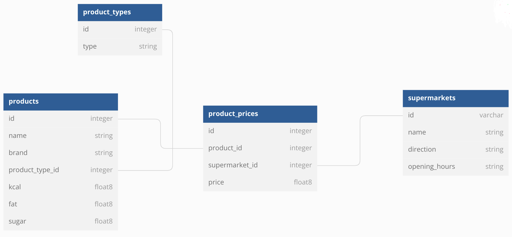

<h1 align="left">Python-examples</h1>

###

<p align="left">This repository contains several Python simple exercises that can be useful for begginers or a quick starting point of your project. Each folder is a different Python project itself.</p>

###

<h2 align="left">Requirements</h2>

###

<p align="left">You need Python3.X and pip installed. First time you run a project, execute:<br><br>
</p>

<code>
pip install -r requirements.txt
</code>

###

<h2 align="left">Exercise_1</h2>

###

<p align="left">This project is a very simple script that iterate from n to r number and print a list as an ouput. If the number is multiple of 3, it is printed 'Such'. If it is multiple of 5, it is printed 'Wow'. if it is multiple of both, it is printed 'SuchWow'. Otherwise, it is printed the original number. To execute:<br><br>
</p>

```python
python3 ./such_wow.py 1 10
```

###

<h2 align="left">Exercise_2</h2>

###

<p align="left">This project is a json API REST server using Flask and SQLite. The database schema constains food products, food product types, supermarkets and the price a product has in each supermarket. Full schema is:</p>

###

<div align="center">
  
</div>

###

<p align="left">Config.py has some configurable parameters like port or database name. To start the API:<p>

```python
python3 ./main.py
```
<p align="left"> If you want to clean and reset the database, execute:</p>

```python
python3 ./main.py reset
```

###

<h3 align="left">API methods</h3>
All API methods return status code 200 for successful operations and 400 code and an error message for failed operations.

###

<h4 align="left">Get product types</h4>
GET /products/types

    curl -i -H 'Accept: application/json' http://localhost:6000/api/v1/product/types

Returns a list of the product types. Example:

```json
[{"id": 1, "type": "Snacks"}, {"id": 2, "type": "Fresh"}]
```

###

<h4 align="left">Get products</h4>
GET /products

    curl -i -H 'Accept: application/json' http://localhost:6000/api/v1/products

Returns a list of the products.

###

<h4 align="left">Add a new product</h4>
POST /products

    curl -X POST http://localhost:6000/api/v1/products -H 'Accept: application/json' -H "Content-Type: application/json" -d '{ "brand":"nestle","type": "2","kcal": 28.5,"fat": 10,"sugar": 20}'

Returns the product created. Example:

```json
{"id": 1, "brand": "nestle", "product_type_id": 2, "kcal": 28.5, "fat": 10.0, "sugar": 20.0}
```

###

<h4 align="left">Update a product</h4>
PUT /products/<i>product_id</i>

    curl -X PUT http://localhost:6000/api/v1/products/1 -H 'Accept: application/json' -H "Content-Type: application/json" -d '{ "brand":"hacendado","type": "2","kcal": 28.5,"fat": 10,"sugar": 20}'

Returns the product created.

###

<h4 align="left">Get supermarkets</h4>
GET /supermarkets

    curl -i -H 'Accept: application/json' http://localhost:6000/api/v1/supermarkets

Returns a list of the supermarkets.

###

<h4 align="left">Add a new supermarket</h4>
POST /supermarkets

    curl -X POST http://localhost:6000/api/v1/supermarkets -H 'Accept: application/json' -H "Content-Type: application/json" -d '{ "name": "Mercadona3", "direction": "Madrid" ,"opening_hours": "09:00-21:00"}'

Returns the supermarket created.

###

<h4 align="left">Asign product price to specific supermarket</h4>
POST /product_prices

    curl -X POST http://localhost:6000/api/v1/product_prices -H 'Accept: application/json' -H "Content-Type: application/json" -d '{ "product_id": 1, "supermarket_id": 1, "price": 30.0}'

Returns the object created.

###

<h4 align="left">Get all products from a supermarket</h4>
GET /supermarkets/<i>supermarket_id</i>/products

    curl -i -H 'Accept: application/json' http://localhost:6000/api/v1/supermarkets/1/products

Returns a list of the products including their prices.

###
